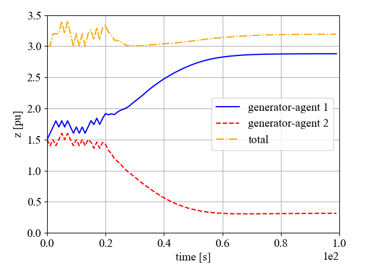

# Load Frequency Control: A Multi-Agent Deep Deterministic Policy Gradient Approach

by
Sergio Rozada,
Dimitra Apostolopoulou
and Eduardo Alonso

This code belongs to a paper that has been published in *IEEE PES General Meeting 2020*.

> The associated paper presents Multi-Agent Reinforcement Learning (MARL) methods to implement a load frequency control without the need of a centralized authority.

    

* Output after change in load by 0.15pu in a two-agents system.*

## Abstract

> The paradigm shift in energy generation towards microgrid-based architectures is changing the landscape of the energy control structure heavily in distribution systems. More specifically, distributed generation is deployed in the network demanding decentralised control mechanisms to ensure reliable power system operations. In this work, a Multi-Agent Reinforcement Learning approach is proposed to deliver an agent-based solution to implement load frequency control without the need of a centralised authority. Multi-Agent Deep Deterministic Policy Gradient is used to approximate the frequency control at the primary and the secondary levels. Each generation unit is represented as an agent that is modelled by a Recurrent Neural Network. Agents learn the optimal way of acting and interacting with the environment to maximise their long term performance and to balance generation and load, thus restoring frequency. In this paper we prove using three test systems, with two, four and eight generators, that our Multi-Agent Reinforcement Learning approach can efficiently be used to perform frequency control in a decentralised way.

### Software structure

* `architecture.py` contains the model used to implement the actors and the critics.
* `dynamics.py` contains the implementation of the equations of the environment.
* `rl.py` contains some utils used in the algorithm.
* `train_two_gens.py` contains the code to train the agents.
* `test_two_gens.py` contains the code to test the trained agents.
* `model` folder contains the trained model.
* `rewards` folder contains a `.pickle` file with the cumulative reward performance of the agent.

## Getting the code

You can download a copy of all the files in this repository by cloning the
[git](https://github.com/sergiorozada12/load-frequency-control) repository:

    git clone https://github.com/sergiorozada12/load-frequency-control.git

or [download a zip archive](https://github.com/sergiorozada12/load-frequency-control/archive/refs/heads/master.zip).